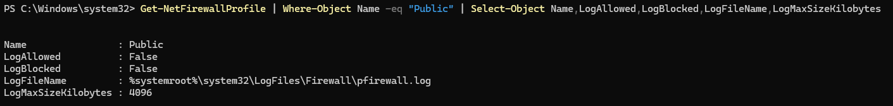
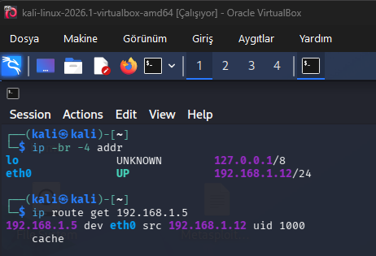
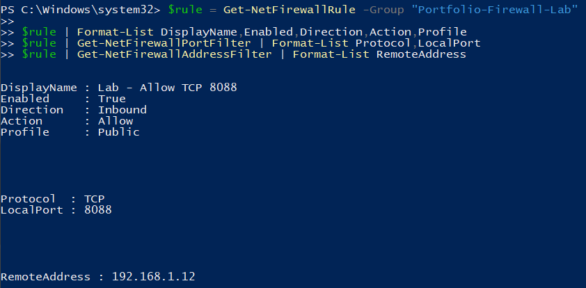
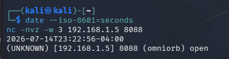
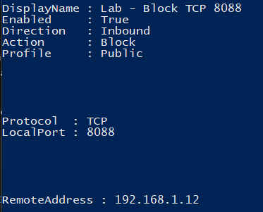
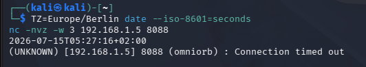
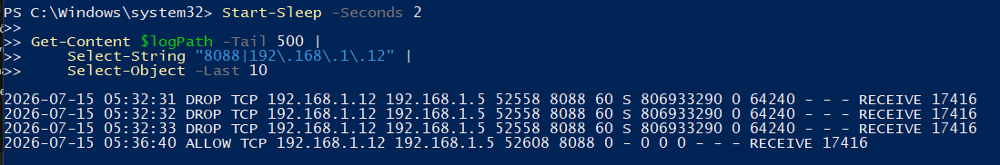

# Windows Firewall Lab Evidence

This gallery contains the evidence I collected while validating an inbound Windows Firewall rule from a Kali Linux virtual machine. The VM used a bridged adapter so the Windows target and Kali client had different addresses on the same network.

## Lab context

| Item | Value |
| --- | --- |
| Date | 2026-07-15 |
| Windows target | `192.168.1.5` |
| Kali client | `192.168.1.12` |
| Windows profile | Public |
| Test service | TCP 8088 |
| Expected allow result | Port open |
| Expected block result | Connection timeout |

The first Kali allow-test screenshot uses the VM's original `UTC-04:00` timezone. Its timestamp is equivalent to `03:22:56 UTC` and `05:22:56 UTC+02:00`. Later evidence uses the Europe/Berlin timezone directly.

## Evidence sequence

### 1. Baseline firewall profile

The active Public profile was enabled. Allowed and blocked connection logging were disabled before the lab.

### 2. Port availability

TCP 8088 was confirmed as available before starting the listener.

### 3. Logging enabled

Allowed and blocked connection logging were enabled for the Public profile with a 20 MB maximum file size.

### 4. Listener active

The Windows host listened on TCP 8088 while the firewall decisions were tested.

### 5. Separate Kali client

The bridged Kali VM used a different address and routed directly to the Windows target.

### 6. Allow rule

The inbound allow rule was limited to the Kali source address, TCP 8088 and the Public profile.

### 7. Allowed connection

Netcat reported TCP 8088 as open from the Kali client.

### 8. Block rule

The allow rule was replaced with a block rule using the same source, port and profile scope.

### 9. Blocked connection

The Kali connection timed out even though the Windows listener remained active.

### 10. Firewall log correlation

The Windows Firewall log recorded DROP and ALLOW events for the same source, destination and destination port.

### 11. Cleanup verification

The lab rule was removed, the listener was stopped and Public-profile logging was restored to its baseline values.

## Conclusion

This test confirmed that a narrowly scoped Windows Firewall rule changed the connection outcome for the same client and service. The Kali results and Windows Firewall records provide two observation points, while the final cleanup output confirms that the temporary configuration did not remain on the host.
